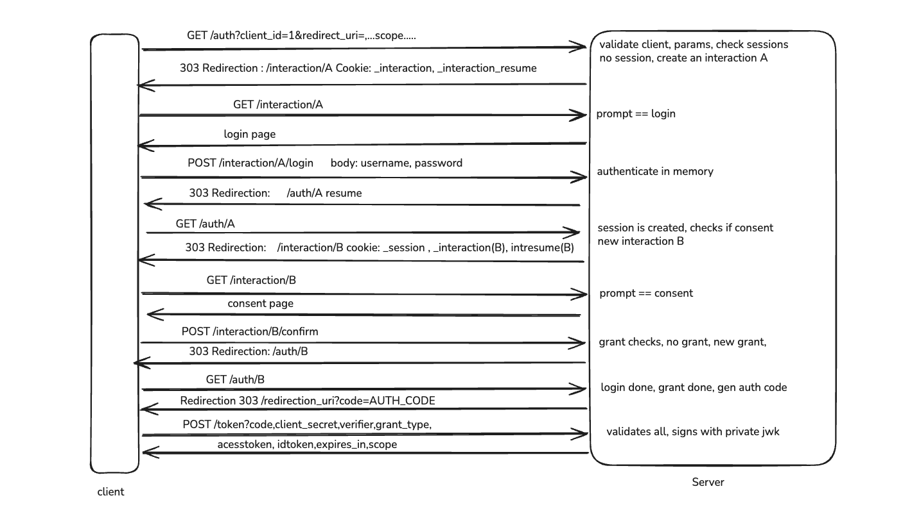

# Node.js OIDC Identity Provider

An OpenID Connect Identity Provider built with Node.js, Express and
[oidc-provider](https://github.com/panva/node-oidc-provider).

It implements the Authorization Code Flow with a custom login and consent UI,
issues RS256-signed ID Tokens, exposes Discovery and JWKS, issues refresh tokens,
supports signing key rotation, and issues JWT access tokens for two demo APIs
(`/orders` and `/billing`) using Resource Indicators (RFC 8707).

## Architecture



## Setup and Start

Requires Node.js 20.6 or newer.

```bash
npm install
npm run gen-keys          # adds an RSA signing key to keys/jwks.json (key-1, then key-2, ...)
cp .env.example .env      # then set COOKIES to a random value
npm start
```

| Variable | Purpose | Example |
|---|---|---|
| `PORT` | Port to listen on | `3000` |
| `ISSUER_URL` | Issuer base URL (port is appended) | `http://localhost` |
| `COOKIES` | Comma-separated cookie signing keys | `randomKey1,randomKey2` |

## Endpoints

| Endpoint | URL |
|---|---|
| Discovery | http://localhost:3000/.well-known/openid-configuration |
| JWKS | http://localhost:3000/jwks |
| Authorization | http://localhost:3000/auth |
| Token | http://localhost:3000/token |
| UserInfo | http://localhost:3000/me |
| Orders API | http://localhost:3000/orders |
| Billing API | http://localhost:3000/billing |

## Test User and Client

| User | Password |
|---|---|
| `portainer` | `portainer123` |

| Client setting | Value |
|---|---|
| `client_id` | `vin-client-1` |
| `client_secret` | `vin-secret-1` |
| `redirect_uri` | `https://oidcdebugger.com/debug` |
| `grant_types` | `authorization_code`, `refresh_token` |
| Scopes | `openid`, `email`, `profile`, `offline_access`, `orders:read`, `billing:read` |

## Login Flow with OIDC Debugger

**1.** Open https://oidcdebugger.com and fill in:

| Field | Value |
|---|---|
| Authorize URI | `http://localhost:3000/auth` |
| Redirect URI | `https://oidcdebugger.com/debug` |
| Client ID | `vin-client-1` |
| Scope | `openid email profile` |
| Response type | `code` |
| Response mode | `form_post` |
| PKCE | Supported (`S256`) |

**2.** Click **Send Request**, sign in as `portainer`, and click **Allow**.

**3.** Exchange the authorization code (valid for 60 seconds, single use):

```bash
curl -X POST http://localhost:3000/token \
  -u vin-client-1:vin-secret-1 \
  -d grant_type=authorization_code \
  -d code=<AUTHORIZATION_CODE> \
  -d redirect_uri=https://oidcdebugger.com/debug
```

With PKCE, add `-d code_verifier=<VERIFIER>`.

**4.** Call UserInfo:

```bash
curl http://localhost:3000/me -H "Authorization: Bearer <ACCESS_TOKEN>"
```

## Verify the ID Token on jwt.io

1. Paste the `id_token` into https://www.jwt.io.
2. Copy the key from http://localhost:3000/jwks whose `kid` matches the token header.
3. Paste it into the public key field. Result: **Signature Verified**.
4. Change any character in the payload. Verification fails.

## Key Rotation

```bash
npm run gen-keys   # adds key-2 in front of key-1
npm start          # restart to load the new key
```

New tokens are signed with `key-2`. `key-1` stays in `/jwks`, so older tokens still verify.

## JWT Access Tokens

| API | Resource | Scope | Lifetime | Signing key |
|---|---|---|---|---|
| Orders | `http://localhost:3000/orders` | `orders:read` | 1 hour | `key-2` |
| Billing | `http://localhost:3000/billing` | `billing:read` | 10 minutes | `key-1` |


## Project Structure

```
src/
  server.js               Express app, mounts interactions, demo APIs and the provider
  constants/config.js     Provider config: client, claims, keys, cookies, resource servers
  routes/interaction.js   Login and consent
  routes/orders.js        Orders API
  routes/billing.js       Billing API
  service/authenticate.js In-memory user store
  views/pages.js          Login and consent pages
scripts/
  generate-keys.js        Adds an RSA signing key to keys/jwks.json
  json-key-reader.js      Builds keys/jwks.json from keys/private.pem (earlier setup, overwrites jwks.json)
keys/                     Private signing keys (git-ignored)
```

## Production Notes

In-memory storage, plain-text test credentials, file-based keys and HTTP are for local use.
Production needs a database adapter, a secret store, a KMS for keys, HTTPS, and refresh token rotation and revocation.
